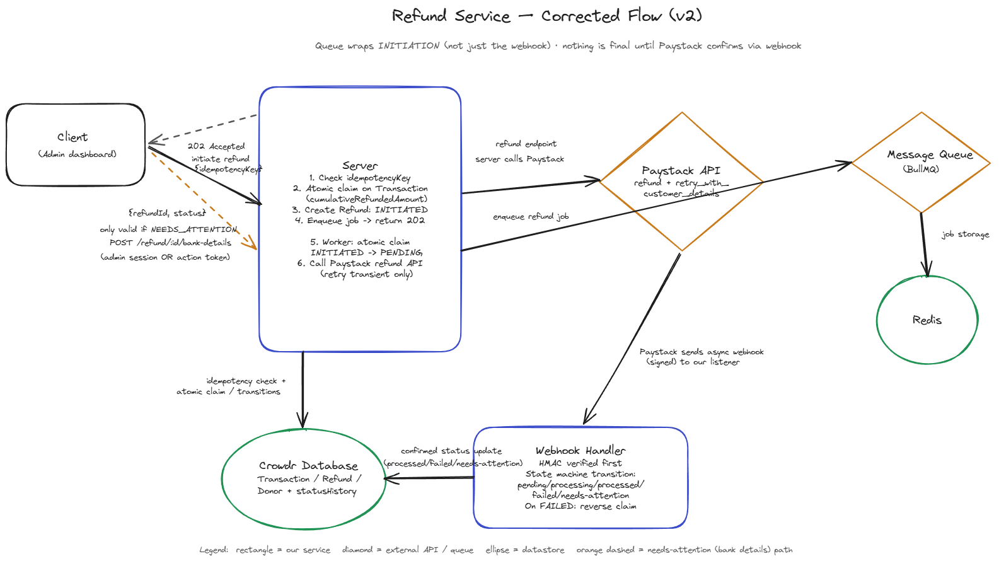

I work on a crowdfunding platform, and for months our refund service looked solid: covered by tests, cleared two rounds of review, and had processed thousands of refunds without incident. It also had a crash window just over a second wide where a refund could hit Paystack, succeed on their end, and leave nothing behind in our database saying it had ever been attempted.

## Why it mattered

A refund that silently disappears isn't just a rounding error. It's a backer emailing support asking where their money went, an operations person re-running a refund that already happened, and eventually a duplicate payout or a chargeback dispute nobody can explain from the logs. None of this required unusual traffic or a malicious actor. A routine pod restart during a deploy was enough.

## The flaw, precisely

The refund flow looked synchronous from the outside: call the initiate-refund endpoint, get a `PROCESSING` refund back, wait for a webhook. What actually happened underneath was riskier. The service called Paystack directly, inline, before anything touched the queue. The queue only wrapped the webhook *confirmation* step, writing the outcome once Paystack called back. If the process crashed after the outbound call left our servers but before we persisted that we'd made it, the refund existed on Paystack's side and nowhere on ours. Retrying wasn't safe, because we had no record to check against. Not retrying meant a real refund with no trace.

## System Design

The fix moves the boundary of "durable" earlier. The outbound call has to happen *inside* a claimed, persisted attempt, not before one exists. The diagram below is the corrected shape: a service that claims a refund atomically before it queues anything, a queue that now owns the call to Paystack itself rather than just its confirmation, and a `NEEDS_ATTENTION` branch for refunds that fail for reasons a retry can't fix, like bad bank details.



Nothing new was added to the diagram. What changed is where the atomic claim and the queue kick in: at initiation, not just the webhook callback. A refund can't leave `INITIATED` without a persisted, uniquely-claimed `PENDING` row, and the call to Paystack only happens after that row exists. There's no window left where the outbound call can succeed without something on our side already knowing it was attempted.

## Closing the gap

Three changes did most of the work.

### An explicit state machine

Refunds used to move through statuses implicitly, inferred from a mix of flags and null checks. Making the states explicit, and making illegal transitions a runtime error instead of a possibility, killed a whole category of "wait, how did this get here" debugging sessions.

```ts
enum RefundStatus {
  INITIATED = 'INITIATED',
  PENDING = 'PENDING',
  PROCESSING = 'PROCESSING',
  PROCESSED = 'PROCESSED',
  FAILED = 'FAILED',
  NEEDS_ATTENTION = 'NEEDS_ATTENTION',
}

const ALLOWED_TRANSITIONS: Record<RefundStatus, RefundStatus[]> = {
  INITIATED: [RefundStatus.PENDING],
  PENDING: [RefundStatus.PROCESSING],
  PROCESSING: [RefundStatus.PROCESSED, RefundStatus.FAILED, RefundStatus.NEEDS_ATTENTION],
  PROCESSED: [],
  FAILED: [RefundStatus.PENDING],
  NEEDS_ATTENTION: [],
};
```

### Idempotency keys, scoped correctly

Our first pass at this used a blanket unique index on the idempotency key, which felt safe and then broke a legitimate retry path: a `FAILED` refund is supposed to be retriable, and a flat unique index blocked exactly that. Scoping the index to the statuses where a duplicate would actually be dangerous fixed it without reopening the original hole.

```js
schema.index(
  { idempotencyKey: 1 },
  {
    unique: true,
    partialFilterExpression: {
      status: { $in: ['PENDING', 'PROCESSING', 'PROCESSED'] },
    },
  },
);
```

### Atomic claims, not application locks

The original "lock" was a boolean flag the application set before doing anything else. That held up fine until the process died between setting the flag and clearing it, leaving the refund stuck locked forever. Replacing it with a single atomic update, scoped to the exact state we expect, means either we claimed it or we didn't. There's no in-between state a crash can strand us in.

```ts
const claimed = await this.refundModel.findOneAndUpdate(
  { _id: refundId, status: RefundStatus.INITIATED },
  { $set: { status: RefundStatus.PENDING, claimedAt: new Date() } },
  { new: true },
);

if (!claimed) {
  return; // already claimed, or already past INITIATED
}
```

## What we left out

Chargebacks and transfer reversals aren't handled by any of this. They go through a separate, older path we didn't touch. That wasn't an oversight, it was a scoping call. Rebuilding this pipeline for crash-safety was already a big enough change to reason about and test properly, and folding in two more failure-prone flows would have made the review process worse without making the fix any safer. They're next, not forgotten.

## The takeaway

The real fix here wasn't more error handling. It was making sure we wrote down that we were about to try something before we tried it.
